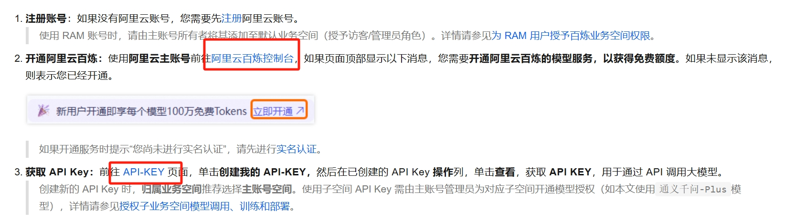

# 快速上手流程
考虑到了OPENAI普通版本账号并没有足够的token quota，因此我们转而考虑 通义千问和deepseek。这里先尝试通义千问。  
通义千问百炼大模型注册，注册即送半年百万大模型TOKEN API 可以供我们调用  
百炼大模型注册网址 [https://bailian.console.aliyun.com/?spm=a2c4g.11186623.0.0.609079808RivJ8#/home](https://bailian.console.aliyun.com/?spm=a2c4g.11186623.0.0.609079808RivJ8#/home)  
[千问API获取](https://help.aliyun.com/zh/model-studio/first-api-call-to-qwen?spm=5176.21213303.J_v8LsmxMG6alneH-O7TCPa.18.3d982f3dXJAvwA&scm=20140722.S_help@@%E6%96%87%E6%A1%A3@@2840915._.ID_help@@%E6%96%87%E6%A1%A3@@2840915-RL_%E9%80%9A%E4%B9%89%E5%8D%83%E9%97%AEAPI-LOC_2024SPAllResult-OR_ser-PAR1_213e36a217457664428748194ea9fa-V_4-RE_new6-P0_2-P1_0)  

注意我们这里使用langchain 不使用OpenAI的模板  
Qwen可以通过langchain_communities 便捷调用

后续也可能考虑COT 等方法 和 prompt_engineering.
使用的时候不要挂梯子！挂梯子连不上  

---
---

直接参考的教程  

[langchain+Qwen](https://zhuanlan.zhihu.com/p/18806936905)
[Qwen模型列表](https://help.aliyun.com/zh/model-studio/models)
---
---

参考过的页面，供查看：  
[https://zhuanlan.zhihu.com/p/21149094957](https://zhuanlan.zhihu.com/p/21149094957)  
[千问调用deepseek](https://help.aliyun.com/zh/model-studio/deepseek-api?spm=a2c4g.11186623.help-menu-2400256.d_2_1_1.226b4823Y4zBLF)    
[千问API获取](https://help.aliyun.com/zh/model-studio/first-api-call-to-qwen?spm=5176.21213303.J_v8LsmxMG6alneH-O7TCPa.18.3d982f3dXJAvwA&scm=20140722.S_help@@%E6%96%87%E6%A1%A3@@2840915._.ID_help@@%E6%96%87%E6%A1%A3@@2840915-RL_%E9%80%9A%E4%B9%89%E5%8D%83%E9%97%AEAPI-LOC_2024SPAllResult-OR_ser-PAR1_213e36a217457664428748194ea9fa-V_4-RE_new6-P0_2-P1_0)  
[langchain+deepseek参考教程](https://cloud.tencent.com/developer/article/2506334)  
[langchain+deepseek参考教程2](https://explinks.com/blog/ua-comprehensive-guide-to-calling-deepseek-with-langchain/)  

后续可能也考虑转到OLLAMA本地部署  

这里还看到两个成熟的github AIagent项目 可以参考  
[聊天机器人](https://github.com/chatchat-space/Langchain-Chatchat)  
[PDF阅读器](https://github.com/mayooear/ai-pdf-chatbot-langchain)
